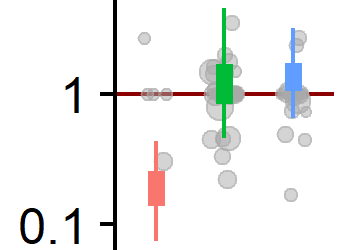

```{r setup, include = FALSE}
library(brms)
library(rstanarm)
library(bayesplot)
library(here)
library(cowplot)
library(parallel)
library(knitr)
options(mc.cores = parallel::detectCores())
rstan::rstan_options(auto_write = TRUE)


opts_chunk$set(echo = FALSE, warning = FALSE, message = FALSE, fig.width = 10)

library(tidyverse)

fits_dir <- here("stored_fits")
if(!dir.exists(fits_dir)) {
  dir.create(fits_dir)
}

```


# What is Bayes?

--

* My personal favourite:
 * Being a Bayesian means quantifying uncertainty with probability distributions.

--

Instead of $\alpha \neq 0, p = 0.001$, 95% CI = $(0.01, 3)$, ...

--

Just say


```{r, fig.width=4, fig.height = 2}
tibble(alpha = rgamma(1000, 10, 10)) %>% ggplot(aes(x=alpha)) + geom_density()
```


---

#Example




```{r load_counts}
counts_raw <- readRDS(here("subset_Acute_Myeloid_Leukemia_Primary_Blood_Derived_Cancer_-_Peripheral_Blood.rds"))

G <- 6
N <- counts_raw$N
counts <- counts_raw$counts_tidy %>% transmute(gene = ens_iso, count = `read count`, sample = sample) %>% droplevels()  %>% 
  mutate(gene = gsub("0000000","", gene, fixed = TRUE) %>% factor()) %>%
  filter(gene %in% unique(gene)[1:G])
                      
base_formula <- count ~ 0 + gene
```

```{r}
plot_counts <- function(counts) {
  counts %>% group_by(gene) %>% 
    filter(sum(count) > 0) %>%
    ggplot(aes(count)) + 
    #stat_bin(bins = 30, geom = "step")  + 
    geom_histogram(bins = 10) +
    facet_wrap(~gene, scales = "free")  
}
```

---

# Poisson "regression"

--

```
lm(count ~ gene, family = poisson)
```

--

$$
\begin{align}
X_i &\sim Poisson(\mu_i)  \\
log(\mu_i) &= \alpha_i
\end{align}
$$

--
$$
\alpha_i \sim N(0, 1)
$$
---

# Bayes rule

$$
P(\alpha | X) = \frac{P(X | \alpha) P(\alpha)}{P(X)}
$$


--

## Relationship to frequentist

--

Frequentist confidence interval $\simeq$ 

Bayesian posterior interval w/o prior

---

# Determining prior

```{r simulate_poisson}
simulate_poisson <- function(N, G, mean_log, sd_log) {
  tibble(gene = sprintf("Gene%02d", 1:G), mean = rlnorm(G, mean_log, sd_log)) %>% rowwise() %>% 
    do(tibble(gene = .$gene, mean = .$mean, count = rpois(N, .$mean))) %>% ungroup()
  
}

simulate_poisson(N,G,0,1) %>% plot_counts() + ggtitle("Poisson, Prior = N(0,1)")
```

---

#Determining prior 2

```{r}
simulate_poisson(N,G,0,10) %>% plot_counts() + ggtitle("Poisson, Prior = N(0,10)")
```


```{r}
plot_fit <- function(counts, fit) {
  predicted <- posterior_predict(fit) %>% t() %>% as.data.frame() %>% cbind(counts %>% select(gene, count)) %>%
    rename(observed = count) %>%
    gather("mcmc_sample","estimated", -gene, -observed) %>%
    gather("source","count", observed, estimated)
  
  #counts_to_plot <- counts %>% select(count, gene) %>% mutate(mcmc_sample = -1, source = "data")
  
  predicted %>% #rbind(counts_to_plot) %>%
    ggplot(aes(count, color = source, fill = source)) +
    #geom_density(alpha = 0.5) +
    stat_bin(geom = "step", position = "identity", bins=15, alpha = 0.7, size = 1.1) +
    facet_wrap(~gene, scales = "free", ncol = 3) + 
    theme(axis.text.y = element_blank())
}
```

---

# Visualise posterior

```{r fit_poisson}
poiss_file <- paste0(fits_dir, "/poisson.rds")
if(!file.exists(poiss_file)) {
  fit_poisson <-  stan_glm(base_formula, family = poisson(), data = counts, prior = rstanarm::normal(0, 10))
  saveRDS(fit_poisson, poiss_file)
} else {
  fit_poisson <- readRDS(poiss_file)
}
```

```{r}
plot_fit(counts, fit_poisson)
```

---

# Poisson - PPCheck mean

```{r}
pp_check(fit_poisson, plotfun = "stat_grouped", group = counts$gene, stat = mean)

```

---

# Poisson - PPCheck sd

```{r}
pp_check(fit_poisson, plotfun = "stat_grouped", group = counts$gene, stat = sd)

```

---

# Negative binomial

$$
\begin{align}
X_i &\sim NB(\mu_i, \phi)  \\
log(\mu_i) &= \alpha_i
\end{align}
$$

--
$$
\begin{align}
\alpha_i &\sim N(0, 10) \\
log(\phi) &\sim N(0, 2) 
\end{align}
$$

---

# NB - visualize posterior

```{r fit_nb}
nb_file <- paste0(fits_dir,"/nb.rds")
if(!file.exists(nb_file)) {
  fit_nb <- stan_glm.nb(base_formula, data = counts, prior = rstanarm::normal(0, 10))
  saveRDS(fit_nb, nb_file)
} else {
  fit_nb <- readRDS(nb_file)
}
```

```{r}
plot_fit(counts, fit_nb)
```

---
# NB - PPCheck sd

```{r}
pp_check(fit_nb, plotfun = "stat_grouped", group = counts$gene, stat = sd) 

```

---

# Negative binomial 2

$$
\begin{align}
X_i &\sim NB(\mu_i, \phi_i)  \\
log(\mu_i) &= \alpha_i
\end{align}
$$

--
$$
\begin{align}
\alpha_i &\sim N(0, 10) \\
log(\phi_i) &\sim N(0, 2) 
\end{align}
$$

---

# NB 2 - visualize posterior

```{r fit_nb_shape}
priors <- c(prior(normal(0, 10), class = b),
            prior(normal(0, 2), dpar = shape))
fit_nb_shape <-  brm(bf(base_formula, shape ~ 0 + gene), data = counts, family = "negbinomial", prior = priors, file = paste0(fits_dir,"/nb_shape.rds"))
```

```{r}
plot_fit(counts, fit_nb_shape)
```

---

# NB 2 - PPCheck SD

```{r}
pp_check(fit_nb_shape, type = "stat_grouped", group = "gene", stat = sd)

```

---

# Take home

--

* Embrace uncertainty 

--

* Bayes let's us use simulation to understand models 

--

* Modern Bayes tools let us build coooomplex models


--

## Further reading:

* Visualization in Bayesian Workflow (Gabry et al., 2018)
* Towards A Principled Bayesian Workflow (Betancourt, 2018 - case study)
* Stan, rstanarm, brms docs

--

Code available at https://github.com/martinmodrak/talks
